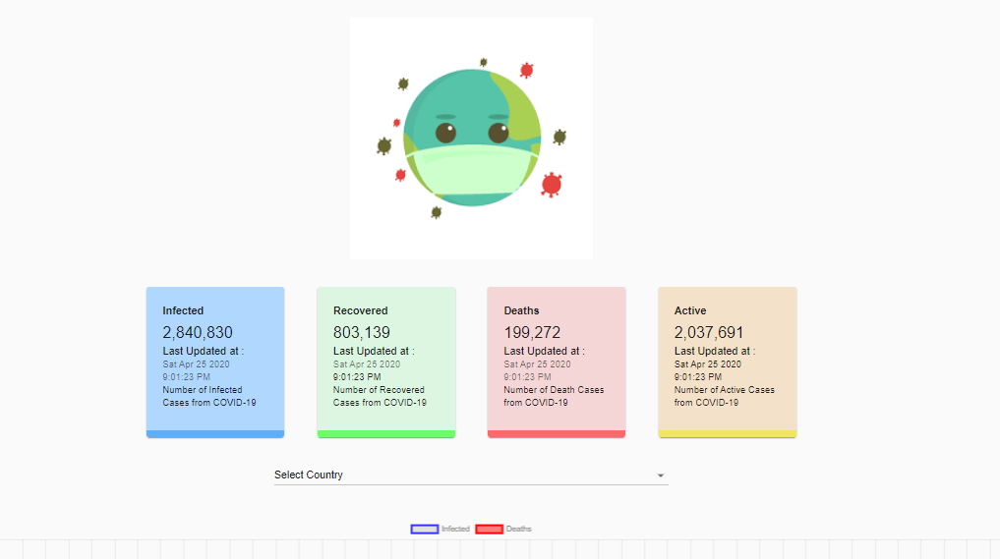
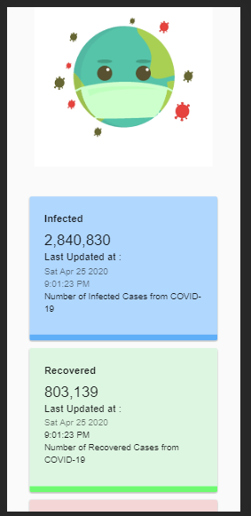

# CoronaTracker





[Live Website Demo](https://coronatracker-1cf6e.web.app/)

## Introduction

The above project is small display of the dashboards of the coronavirus cases. The above website demonstrates the 4 parameters(Infected, Recovered, Deaths, Active). It demonstrtaes global cases and also country wise cases.

Tech Stack used is  React, Charts.JS and Material UI and deployment is done on firebase.

API Used -  https://covid19.mathdro.id/api

--

For installation of project and run

```Javascript
>git clone https://github.com/milu234/Covid19_Tracker
>cd corona
>npm start
```

